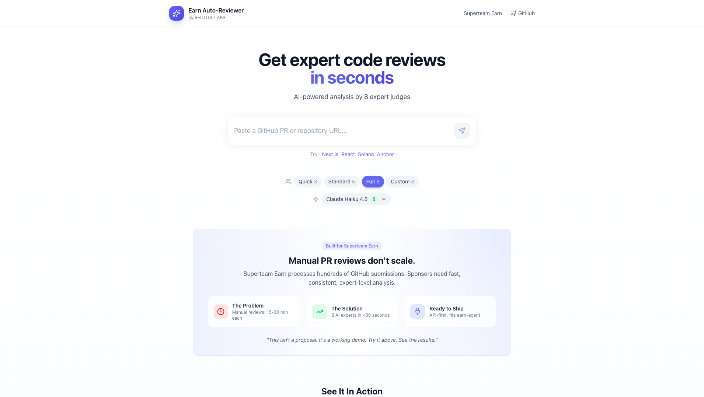

<div align="center">

# Earn Auto-Reviewer

### AI-Powered Code Reviews for Superteam Earn

[](https://earn-auto-review.rectorspace.com)
[](https://nextjs.org)
[](https://typescriptlang.org)
[](LICENSE)

**8 AI expert judges • Instant 0-100 scores • Actionable feedback**

[Live Demo](https://earn-auto-review.rectorspace.com) • [Bounty](https://earn.superteam.fun/listing/add-github-links-to-earn-auto-reviews) • [Documentation](#-documentation)

<br />



</div>

---

## The Problem

**Manual PR reviews don't scale.** Superteam Earn processes hundreds of GitHub submissions. Sponsors need fast, consistent, expert-level analysis.

| Manual Review | Auto-Reviewer |
|--------------|---------------|
| 15-30 min per PR | **< 30 seconds** |
| Inconsistent criteria | **8 specialized judges** |
| Reviewer fatigue | **Always consistent** |
| Subjective scores | **Weighted 0-100 scoring** |

---

## How It Works

```
┌─────────────┐     ┌─────────────┐     ┌─────────────┐     ┌─────────────┐     ┌─────────────┐
│  Paste URL  │ ──▶ │ Fetch Code  │ ──▶ │  AI Parse   │ ──▶ │ Multi-Judge │ ──▶ │   Score &   │
│  PR / Repo  │     │ Files, Diff │     │   Optimize  │     │  8 Experts  │     │   Report    │
└─────────────┘     └─────────────┘     └─────────────┘     └─────────────┘     └─────────────┘
```

**1. Paste URL** → Any GitHub PR or repository
**2. Fetch Code** → Files, diffs, metadata via GitHub API
**3. AI Parse** → Smart token optimization for large PRs
**4. Multi-Judge** → 8 specialized AI experts analyze in parallel
**5. Score & Report** → 0-100 score with detailed findings

---

## The 8-Judge Panel

Each expert focuses on what they know best:

| Judge | Focus Area |
|-------|-----------|
| 🏗️ **Code Architect** | Structure, patterns, SOLID principles |
| 🔒 **Security Sentinel** | Vulnerabilities, auth, input validation |
| ⚡ **Perf Optimizer** | Speed, efficiency, algorithmic complexity |
| 🎨 **UX/DX Advocate** | Developer experience, API design |
| 🧪 **Testing Champion** | Coverage, test quality, edge cases |
| 📚 **Docs Guru** | Documentation, comments, README |
| 💡 **Innovation Scout** | Creative solutions, modern approaches |
| 🔗 **Integration Expert** | CI/CD, deployment, compatibility |

---

## Scoring Methodology

Weighted evaluation across 4 dimensions:

| Dimension | Weight | What We Evaluate |
|-----------|--------|------------------|
| **Code Quality** | 40 pts | Design patterns, complexity, best practices, security |
| **Completeness** | 30 pts | Requirements met, documentation, edge case handling |
| **Testing** | 20 pts | Test coverage, assertions, integration tests |
| **Innovation** | 10 pts | Creative solutions, efficiency, technical sophistication |

**Grade Scale**: A+ (95+) → A (90+) → B+ (85+) → B (80+) → C+ (75+) → C (70+) → D (60+) → F

---

## Tech Stack

<table>
<tr>
<td align="center" width="150">

**Frontend**

</td>
<td align="center" width="150">

**AI/LLM**

</td>
<td align="center" width="150">

**APIs**

</td>
<td align="center" width="150">

**Deploy**

</td>
</tr>
<tr>
<td align="center">

Next.js 16<br/>
React 19<br/>
TypeScript<br/>
Tailwind CSS

</td>
<td align="center">

Vercel AI SDK<br/>
OpenRouter<br/>
Claude / GPT-4<br/>
Multi-model

</td>
<td align="center">

GitHub REST<br/>
Octokit<br/>
Zod validation

</td>
<td align="center">

Vercel<br/>
Docker ready<br/>
CI/CD

</td>
</tr>
</table>

---

## Quick Start

### Prerequisites

- Node.js 20+
- [OpenRouter API key](https://openrouter.ai/keys)
- GitHub token (optional, for higher rate limits)

### Installation

```bash
# Clone
git clone https://github.com/RECTOR-LABS/earn-auto-reviewer.git
cd earn-auto-reviewer

# Install
npm install

# Configure
cp .env.example .env.local
# Edit .env.local with your API keys

# Run
npm run dev
```

### Environment Variables

```bash
# Required
OPENROUTER_API_KEY=sk-or-v1-your-key

# Optional (5000 req/hr vs 60 req/hr)
GITHUB_TOKEN=ghp_your-token
```

---

## API Reference

### `POST /api/review`

```bash
curl -X POST https://earn-auto-review.rectorspace.com/api/review \
  -H "Content-Type: application/json" \
  -d '{"url": "https://github.com/owner/repo/pull/123"}'
```

<details>
<summary><strong>Response Schema</strong></summary>

```json
{
  "overall": {
    "score": 85,
    "grade": "B+",
    "verdict": "Excellent Submission",
    "summary": "Well-structured code with good test coverage..."
  },
  "judges": [
    {
      "id": "architect",
      "name": "Code Architect",
      "score": 88,
      "verdict": "Excellent",
      "findings": [
        {
          "severity": "info",
          "title": "Clean Architecture",
          "message": "Excellent separation of concerns..."
        }
      ]
    }
  ],
  "metadata": {
    "reviewedAt": "2025-12-15T00:00:00.000Z",
    "url": "https://github.com/owner/repo/pull/123",
    "type": "pr",
    "modelUsed": "anthropic/claude-3.5-haiku",
    "reviewDuration": "12.5s"
  }
}
```

</details>

<details>
<summary><strong>Error Codes</strong></summary>

| Code | Description |
|------|-------------|
| `MISSING_URL` | URL parameter not provided |
| `INVALID_URL` | Invalid or non-GitHub URL |
| `GITHUB_NOT_FOUND` | PR or repository not found (404) |
| `GITHUB_FORBIDDEN` | Private repository (403) |
| `AI_CONFIG_ERROR` | API key issue |

</details>

---

## Features

| Feature | Description |
|---------|-------------|
| **Smart Caching** | Results cached with commit hash validation |
| **Token Optimization** | Intelligent filtering for large PRs (50k+ lines) |
| **Multi-Model** | Switch between Claude, GPT-4, Llama via OpenRouter |
| **Panel Presets** | Quick (3), Standard (5), Full (8), Custom judges |
| **Edge Cases** | Graceful handling of 404s, private repos, rate limits |

---

## Cost Analysis

Using Claude 3.5 Haiku via OpenRouter:

| PR Size | Estimated Cost |
|---------|---------------|
| Small (< 500 lines) | ~$0.01 |
| Medium (500-2000 lines) | ~$0.02-0.05 |
| Large (2000+ lines) | ~$0.05-0.10 |

**At scale**: 1,000 reviews ≈ $20-50

---

## Documentation

- [INTEGRATION.md](./INTEGRATION.md) - Production integration guide
- [CLAUDE.md](./CLAUDE.md) - Project context and architecture
- [/proposal](https://earn-auto-review.rectorspace.com/proposal) - Detailed proposal page

---

## Links

| Resource | URL |
|----------|-----|
| **Live Demo** | https://earn-auto-review.rectorspace.com |
| **Bounty** | https://earn.superteam.fun/listing/add-github-links-to-earn-auto-reviews |
| **GitHub** | https://github.com/RECTOR-LABS/earn-auto-reviewer |

---

## License

MIT License - see [LICENSE](LICENSE) for details.

---

<div align="center">

**Built by [RECTOR-LABS](https://github.com/RECTOR-LABS)**

*"This isn't a proposal. It's a working demo."*

</div>
