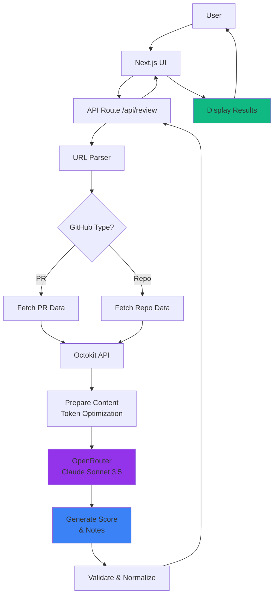

# Superteam Earn Auto-Reviewer

AI-powered GitHub submission reviews for Superteam Earn bounties. Get instant scores (0-100) and actionable feedback on pull requests and repositories using Claude Sonnet 3.5.

**Live Demo**: https://earn-auto-review.rectorspace.com

**Bounty**: https://earn.superteam.fun/listing/add-github-links-to-earn-auto-reviews

---

## 🎯 Overview

This project provides an intelligent, automated review system for GitHub submissions on the Superteam Earn platform. It analyzes pull requests and repositories to generate comprehensive scores and actionable feedback, helping maintainers quickly assess bounty submissions.

### Key Features

- **🎯 Smart Scoring**: Comprehensive 0-100 score based on:
  - Code Quality (40 points) - Design patterns, complexity, best practices
  - Completeness (30 points) - Requirements met, documentation, edge cases
  - Testing (20 points) - Test coverage, test quality
  - Innovation (10 points) - Creative solutions, efficiency

- **⚡ Fast Reviews**: Results in under 15 seconds using AI-powered analysis

- **📝 Actionable Feedback**: 3-5 specific, actionable notes to improve submission quality

- **🛡️ Edge Case Handling**: Graceful handling of 404s, private repos, invalid URLs, rate limits

- **🔄 Multiple URL Formats**: Supports PR URLs, repository URLs, commit URLs, and branch URLs

---

## 🏗️ Architecture



### Data Flow

1. **User Input**: User submits GitHub URL (PR or repository)
2. **URL Parsing**: System detects type and extracts owner/repo/identifier
3. **GitHub API**: Fetches PR/repo data using Octokit (with authentication)
4. **Content Preparation**: Optimizes content for LLM (max 50k chars, prioritizes code)
5. **AI Analysis**: Claude Sonnet 3.5 analyzes code and generates review
6. **Score Validation**: Validates scores are within valid ranges
7. **Response**: Returns structured JSON with scores and actionable notes

---

## 🚀 Tech Stack

**Frontend**:
- Next.js 14 (App Router)
- TypeScript
- Tailwind CSS
- shadcn/ui components

**Backend**:
- Next.js API Routes
- Octokit (GitHub REST API)
- Vercel AI SDK
- OpenRouter (Claude Sonnet 3.5)

**Deployment**:
- Vercel
- Custom domain: earn-auto-review.rectorspace.com

---

## 📦 Installation

### Prerequisites

- Node.js 18+ and npm
- OpenRouter API key ([Get one here](https://openrouter.ai/keys))
- GitHub Personal Access Token (optional, for higher rate limits)

### Setup

1. **Clone the repository**
```bash
git clone https://github.com/RECTOR-LABS/earn-auto-reviewer.git
cd earn-auto-reviewer
```

2. **Install dependencies**
```bash
npm install
```

3. **Configure environment variables**

Create a `.env.local` file in the root directory:

```bash
# OpenRouter API Key (Required)
# Get yours at: https://openrouter.ai/keys
OPENROUTER_API_KEY=sk-or-v1-your-key-here

# GitHub Personal Access Token (Optional - for 5000 req/hour vs 60 req/hour)
# Create at: https://github.com/settings/tokens
# Required scope: public_repo
GITHUB_TOKEN=ghp_your-token-here
```

4. **Run the development server**
```bash
npm run dev
```

Open [http://localhost:3000](http://localhost:3000) in your browser.

5. **Build for production**
```bash
npm run build
npm start
```

---

## 🎮 Usage

### Web Interface

1. Visit the demo site
2. Paste a GitHub URL (PR or repository) OR click an example button
3. Wait 10-15 seconds for analysis
4. View score breakdown and review notes
5. Click "Review Another" to test more submissions

### API Endpoint

**POST /api/review**

Request:
```json
{
  "url": "https://github.com/owner/repo/pull/123"
}
```

Response (200 OK):
```json
{
  "score": {
    "total": 85,
    "breakdown": {
      "codeQuality": 35,
      "completeness": 28,
      "testing": 15,
      "innovation": 7
    }
  },
  "notes": [
    {
      "type": "positive",
      "message": "Excellent error handling with comprehensive try-catch blocks"
    },
    {
      "type": "negative",
      "message": "Missing unit tests for edge cases in authentication flow"
    },
    {
      "type": "neutral",
      "message": "Consider extracting magic numbers to named constants"
    }
  ],
  "metadata": {
    "reviewedAt": "2025-12-09T00:00:00.000Z",
    "url": "https://github.com/owner/repo/pull/123",
    "type": "pr"
  }
}
```

Error Response (4xx/5xx):
```json
{
  "error": "Detailed error message",
  "code": "ERROR_CODE"
}
```

**Error Codes**:
- `MISSING_URL` - URL parameter not provided
- `INVALID_URL` - Invalid or non-GitHub URL
- `GITHUB_NOT_FOUND` - PR or repository not found (404)
- `GITHUB_FORBIDDEN` - Access denied / private repository (403)
- `AI_CONFIG_ERROR` - OpenRouter API key issue
- `INTERNAL_ERROR` - Unexpected server error

---

## 🧪 Edge Cases Handled

| Scenario | Behavior |
|----------|----------|
| Invalid URL format | Returns 400 with `INVALID_URL` error |
| Non-GitHub URL | Returns 400 with `INVALID_URL` error |
| Private repository | Returns 403 with `GITHUB_FORBIDDEN` error |
| 404 / Deleted repo | Returns 404 with `GITHUB_NOT_FOUND` error |
| Empty repository | Reviews with note about no code to analyze |
| Draft PR | Flagged in metadata, reviewed normally |
| Massive PR (>10k lines) | Smart truncation, prioritizes code files |
| No README | Reviews code structure, notes missing docs |
| No tests | Lower testing score, note added |
| Rate limit exceeded | Returns 429, suggests retry after cooldown |

---

## 💰 Cost Analysis

**OpenRouter Pricing** (using Claude Sonnet 3.5):
- Input: $3.00 per 1M tokens
- Output: $15.00 per 1M tokens

**Average Review Costs**:
- Small PR (< 500 lines): ~$0.01 - $0.02
- Medium PR (500-2000 lines): ~$0.02 - $0.05
- Large PR (2000+ lines): ~$0.05 - $0.10
- Repository review: ~$0.03 - $0.08

**Estimated Costs at Scale**:
- 100 reviews: ~$2 - $5
- 1,000 reviews: ~$20 - $50
- 10,000 reviews: ~$200 - $500

**Token Optimization**:
- PR diffs limited to 50k characters
- Lockfiles and generated files excluded
- Smart prioritization of code files over config

---

## 📊 Project Structure

```
earn-auto-reviewer/
├── app/
│   ├── api/
│   │   └── review/
│   │       └── route.ts          # Main API endpoint
│   ├── page.tsx                  # Demo UI
│   ├── layout.tsx                # Root layout
│   └── globals.css               # Global styles
├── components/
│   ├── ui/                       # shadcn/ui components
│   ├── url-input.tsx             # URL input form
│   ├── review-display.tsx        # Score & notes display
│   └── loading-state.tsx         # Loading skeleton
├── lib/
│   ├── github.ts                 # GitHub API integration
│   ├── reviewer.ts               # AI review engine
│   ├── scoring.ts                # Score validation & grading
│   └── prompts.ts                # LLM system prompts
├── types/
│   └── index.ts                  # TypeScript type definitions
├── .env.local                    # Environment variables (gitignored)
├── .env.example                  # Environment template
├── CLAUDE.md                     # Project context for AI
├── INTEGRATION.md                # Production integration guide
└── README.md                     # This file
```

---

## 🚢 Deployment

### Vercel (Recommended)

1. **Connect Repository**
   - Go to [Vercel Dashboard](https://vercel.com/new)
   - Import `RECTOR-LABS/earn-auto-reviewer`
   - Select `dev` or `main` branch

2. **Configure Environment Variables**
   - Add `OPENROUTER_API_KEY`
   - Add `GITHUB_TOKEN` (optional)

3. **Deploy**
   - Vercel will auto-deploy
   - Custom domain: earn-auto-review.rectorspace.com

4. **DNS Configuration**
   - Type: CNAME
   - Name: earn-auto-review
   - Value: cname.vercel-dns.com

See [INTEGRATION.md](./INTEGRATION.md) for production integration with Superteam Earn platform.

---

## 🔗 Links

- **Live Demo**: https://earn-auto-review.rectorspace.com
- **Bounty Listing**: https://earn.superteam.fun/listing/add-github-links-to-earn-auto-reviews
- **GitHub Repository**: https://github.com/RECTOR-LABS/earn-auto-reviewer
- **OpenRouter**: https://openrouter.ai
- **Superteam Earn**: https://earn.superteam.fun

---

## 🤝 Contributing

This project was built as a demo for a Superteam Earn bounty. Contributions are welcome!

1. Fork the repository
2. Create a feature branch (`git checkout -b feature/amazing-feature`)
3. Commit your changes (`git commit -m 'Add amazing feature'`)
4. Push to the branch (`git push origin feature/amazing-feature`)
5. Open a Pull Request

---

## 📝 License

MIT License - see [LICENSE](LICENSE) file for details

---

## 🏆 Built By

**RECTOR-LABS**
- GitHub: [@RECTOR-LABS](https://github.com/RECTOR-LABS)
- Contact: [Telegram @JayeshVP24](https://t.me/JayeshVP24)

---

## 🙏 Acknowledgments

- [Superteam Earn](https://earn.superteam.fun) for the bounty opportunity
- [OpenRouter](https://openrouter.ai) for AI API access
- [Anthropic](https://anthropic.com) for Claude Sonnet 3.5
- [Vercel](https://vercel.com) for hosting and AI SDK
- [shadcn/ui](https://ui.shadcn.com) for beautiful components

---

**Status**: ✅ Core implementation complete | 🚧 Testing and deployment in progress

**Last Updated**: December 9, 2025
